# **Graph Theory Project 2020**

3rd Year Graph Theory Project

Michael Mulholland - G00362383

 

# **Introduction**

This program is using the Python programming language to build a non-deterministic finite automation (NFA) from a regular expression. A regular expression is a string containing a series of characters, some of which may have a special meaning. 
This program will use the NFA to check if the regular expression matches any given string of text. If there is a match, true will be returned, otherwise false.

	

 
 

# **GitHub Repository Contents**

## Images folder:
Contains all images for the README including:
* a.b.jpg
* a_kleane.jpg
* a_OR_b.jpg
* one_or_many.jpg
* zero_or_one.jpg
* vim.jpg
* vinImage.jpg

 

## htmlcov folder
It contains 13 files but the main ones are:
* index.html
* regex.html
* test_program.html

It displays a nicer presentation of the tests coverage reports that are created when using coverage.py. Further down I have explained what coverage.py is.

 

## __pycache__:
* When you run a program in python, the interpreter compiles it to bytecode first and stores it in the __pycache__ folder.  These are bytecode-compiled and optimized bytecode-compiled versions of your program's files, respectively. All it does is make your program start a little faster. You can ignore this folder.

 

## .gitignore
* This text file that tells Git which files or folders to ignore in the project.

 

## README.md
* A README is a the file that introduces and explains my project. It contains information that is required to understand what the project is about, how to setup and run it and any other key information needed for my project.

 

## __init__.py
* It is used to mark directories on disk as Python package directories. If you remove the __init__.py file, Python will no longer look for submodules inside that directory, so attempts to import the module will fail.

 

## test_program.py
* This file contains a lot of tests for my program. I am using unittests to carry out the tests. The unittest is a module in Python’s standard library. It contains tools for testing your code. Unit testing checks if all specific parts of your function’s behavior are correct.

 

## regExpResults.txt
* This file contains the regular expression and string that is entered by the user. So every time the user enters a regular expression and string, the regular expression, string and a result (True/False) is outputted to the file.

 

## project.pdf
* It contains the instructions for the Graph Theory Project 2020.

 

## get-pip.py
* This is a base85 encoding of a zip file, this zip file contains an entire copy of pip (version 20.1). Pip is a thing that installs packages, pip itself is a package that someone might want to install, especially if they're looking to run this get-pip.py script.

 

## runner.py

* This class is used to start the program. 
* Once the user executes the runner.py file, the following is imported:
	* the match function from regex.py
		* compiles the regular expression into an Non-Deterministic Finite Automation (NFA)
	* the test_program.py
		* contains tests to be run on the program to verify that the program works as expected
	* unittest
		* unit testing famework
	* argparse
		* it’s a command-line parsing module in the Python standard library that allowed me to write a user-friendly command-line.
		
* argparse
	* The argpase is a feature that provides useful information about the program and how to run it correctly. 
	* In order to view these commands, the user must add on “-h” to the end of there command to execute the program.

	* For example, the file is called runner.py. The user will type the following:
		* Python3 runner.py -h

	* This will provide useful information about the program and how to run it correctly. 

	* I have implement the following:
		* -h (--help)
			* provides useful information about the program and how to run it correctly.
		* -V (--version)
			* displays the python version
		* -r (--run)
			* brief description on how to run the program
		* -v (--verbose)
			* displays the regex, string and result but with more words than necessary
			* only works for option 2
		* -q (--quite)
			* displays the regex, string and result but with less words 
			* only works for option 2

* I have explained in detail how to run the above commands under the heading “Run”.
The code is run within a while True loop. This is to allow the user to run as many tests as they like without having to restart the program every time (there is an option to quit the program).
		
* When the program runs the user will be prompted to select one of the following options:
	* Option 1: to test your own regular expression and String.
	* Option 2: to run pre-written tests.
	* Option 3: to quit the program.

* If the user selects option 1 or option 2, the program will then call the match function and use the NFA to check if the regular expression matches any given string of text. If it does match, True will be returned. If it doesn't match, False will be returned.

* Option 1
	* If option one is selected, the user will be asked to enter the following: 
		* a regular expression
		* a string

	* The regular expression and string will be passed into the match() function.  
Once the user hits enter, the match() function will return “True”, if the regular expression matches the string, otherwise it returns “False”.
	* When the user hits enter, all the users input will be outputted to a txt file called regExpResults.txt. I am appending to the file. Meaning that the data within the file will never be overwritten. Even if the user exits the program and restarts it.

* Option 2
	* Option two can run in three different ways and that is down to how the user executed the runner.py file.

	* The three options are as follows:
		* Python3 runner.py -v
			* Displays to the screen the regex, string and result of pre-written tests but with more words than necessary
		* Python3 runner.py -q
			* displays the regex, string and result but with less words 
		* Python3 runner.py
			* this option run all the tests in the test_program.py file using the unittest framework

	* I am using two arrays. One for the regular expressions and one for the strings. I've used a nested for loop to compare each index of the regex array with every index of the strings array to see if they match.

* Option 3
	* If option three is selected, the program will exit.

 

## regex 
* Class State
	* A state with one or two edges, all edges labeled by label. The State class contains a constructor that creates two variables, edges and labels. Every State has 0, 1, or 2 edges from it and a label for the arrows (None).

* Class Fragment
	* An NFA fragment with a start state and an accept state. The Fragment class contains a constructor that creates a start state of the NFA fragmant and the accept state of the NFA fragmant.

* Shunt Function
	* The Shunt function reads in a string(infix regular expression) and return the infix regular expression in postfix. It loops through the input one character at a time and decides what to do based on the character.

* Compile Function
	* It takes the posfix regular expression created in the Shunt Function and turns it into an NFA. The posfix regular expression is reversed and looped through.

* Followes Function
	* It's a recursive function that adds a state to a set, and follows all of the e(psilon) arrows but only if we haven't already seen the state.

 

# **Run Program**

## PyCharm Installation

* Navigate to jetbrains.com
 

		

* Click on “Find your IDE” under IntelliJ-based IDEs
 

		

* Click on PyCharm
 

		

* Click on Download, Community version.
 

	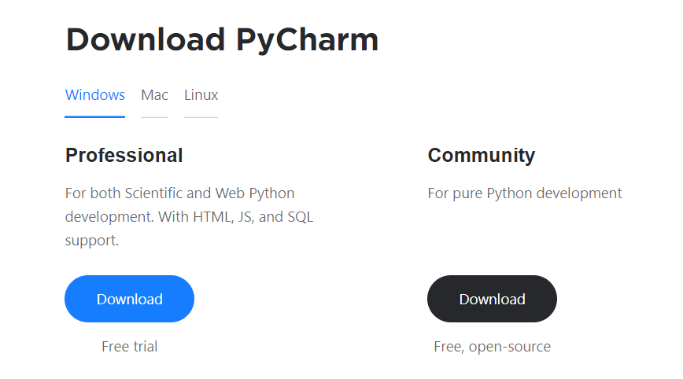	

* Navigate to your downloads folder and double click on the pycharm-community-2020.1.exe file.
* Follow the instructions and click Install Now.

* PyCharm Community is now installed.

	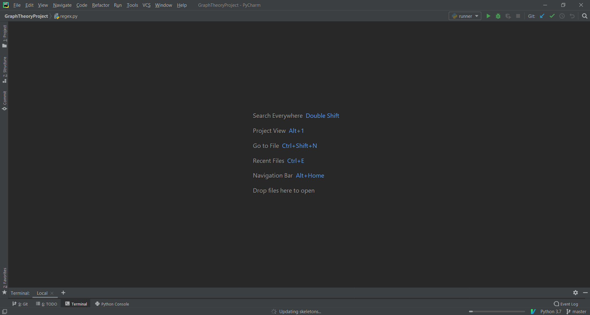	

 
  
## Cloning Graph Theory Project From GitHub

* Navigate to the GitHub repository
	* https://github.com/G00362383/Graph-Theory-Project

* Click on the green button “Clone or download”
 

	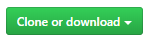	

* Then click “Download ZIP”
 

	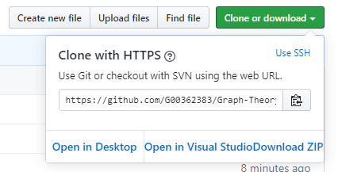	

* Navigate to your downloads folder, right click on the ZIP folder and extract the ZIP folder to your preferred location.
* Import the folder into your preferred IDE but I am going to explain how to do it with PyCharm.

 
* Open up PyCharm
* Click File => Open => Navigate to the location of the folder that you downloaded from GitHub and click OK.

* Click on the Terminal tab at the bottom left-hand side of the screen. 
 

	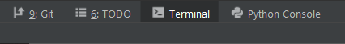	

* As explained under the heading GitHub Repository Contents. The user has the following options when running the program.
	* python runner.py -h
	* python runner.py -V
	* python runner.py -r
	* python runner.py -v
	* python runner.py -q
	* python runner.py
	

If the user enters python runner.py -h, they will see helpful information and then the program will exit.

	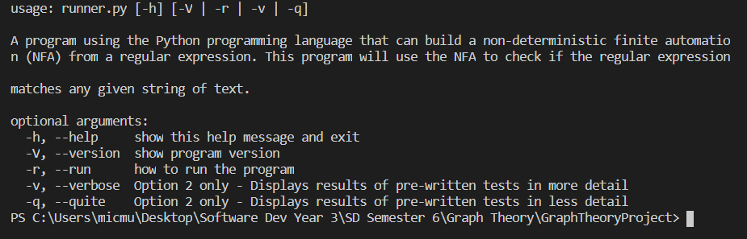	

If the user enters python runner.py -V, they will see the python version and then the program will exit.

	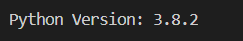	

If the user enters python runner.py -r, they will see details on how to run the program and then the program will exit.

	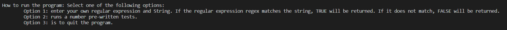	

* If the user selects -v, -q or no argument, they will then be presented with three options and you have to select one.

	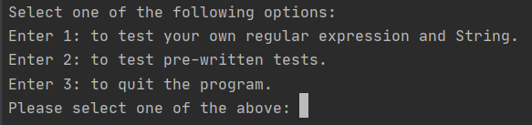	

* Option 1
	* If the user selects option 1, the user will prompt to enter a regular expression and a string. When the user hits the enter button, the result (true/false) will be displayed onto the screen.
 

	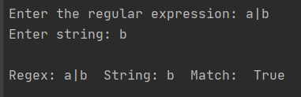	

* Option 2

It displays a small description of the program and lists the optional arguments.

If the user enters python runner.py -v and then selects option 2, they will see the following display.

	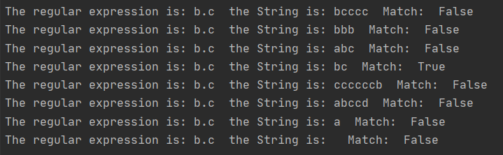	

If the user enters python runner.py -q and then selects option 2, they will see the following display.

	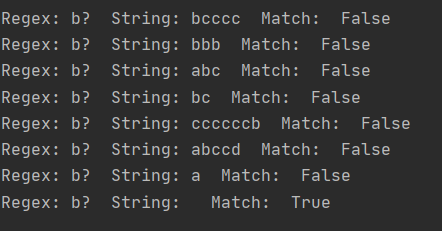	

If the user enters python runner.py and then selects option 2, they will see the following display. This runs five tests in the test_program.py file using the unittest framework. 

 

	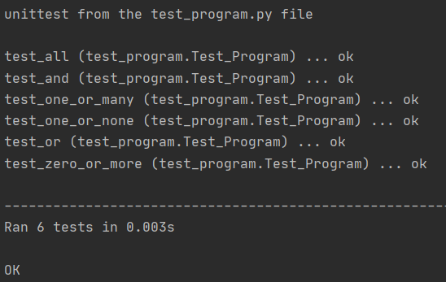	

* Option 3
	* If option three is selected, the program will exit.

 

## **Testing**

There are two ways to test the program. Through one of the following:
* VIM
* Command Prompt

 

**VIM**

The first is by selecting option 1.
* The user enters in their own regular expression and string. Once you hit enter on your keyboard, the regular expression and string will be passed into a match() function in the regex.py file. This function will return True if the regular expression regex matches the string s, otherwise it returns False. 

The second is by selection option 2. 
* (If the user enters either -v or -q argument at the end of the command to run the program)
This runs pre-written tests. For these tests, I am using two arrays. One for the regular expressions and one for the strings. I've used a nested for loop to compare each index of the regex array with every index of the strings array to see if they match.

(If the user enters no argument at the end of the command to run the program)
* This runs a series of pre-written tests that I have in a file called test_program.py. The user will not see what tests are been run, they will only see OK if all tests pass or FAIL if they didn’t. I am using the unittest framework to do this. Unittest is a Python language version of JUnit.

 

**Command Prompt**

First, install the latest version of python on your computer by going to the following link 
* https://www.python.org/downloads/

Then do the following:
* Open Command line: Start menu => Run and type cmd.
* Navigate to the location of the project folder.
* Type the following and the hit Enter.
	* Python runner.py
 
From here, the tests are run exactly as they are under the Heading, Test=>VIM.

**Coverage**

I have also installed coverage.py. It is a tool for measuring code coverage within the python program. It monitors your program, noting which parts of the code have been executed, then analyzes the source to identify code that could have been executed but was not. Coverage measurement is typically used to gauge the effectiveness of tests. It can show which parts of your code are being exercised by tests, and which are not.

Installing Coverage
* If you are using Python 2 >=2.7.9 or Python 3 >=3.4 downloaded from python.org or if you are working in a Virtual Environment created by virtualeny or pyvnv. Just make sure to upgrade pip by going to the following.
	* https://pip.pypa.io/en/stable/installing/

Using Coverage
* Enter the following to run all unittest within the folder.
* Coverage run -m unittest discover
 

	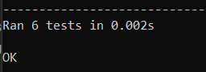	

 
The above command will scan the folder and if it finds unittest, it’ll run them.

Use the following to view a report on the results:
* Coverage report -m
 

	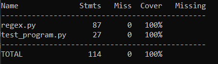	

 
This show that all my code has been test and nothing was missed.

To view a nicer presentation, use the following:
	* coverage html
 

	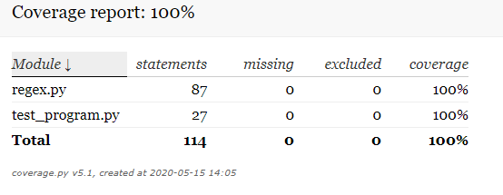	

 
This will create a new folder in your project folder with the results but in a nice presentation.

It will also create a regex.html and test_program.html file display the test coverage in each.

	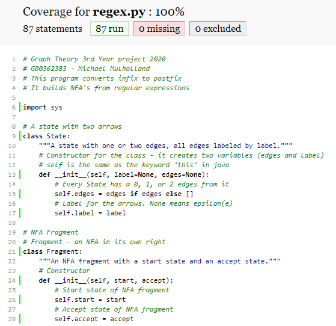
	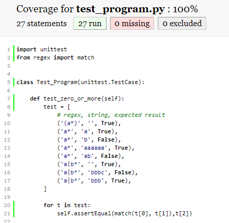	

 

## **Algorithm** 

**Shunt Function**

The Shunt function reads in a string(infix regular expression) and return the infix regular expression in postfix. It loops through the input one character at a time and decides what to do based on the character.

Description of the code within the shunt function.
* if c == '(':
	* Pushes the opening bracket to the stack
* elif c == ')':
	* Within the elif, the while loop checks to see if the last character on the list is not an opening bracket.
	* If it's not an opening bracket, pop all the characters from the opers stack and add them to the postfix.
	* The open bracket is then popped and removed.
* elif c in prec:
	* Within the elif, the while loop checks to see which operator has higher precedence.
	* The precedence of the operator decides if it'll be positioned before or after the symbol on the opers stack.
* else
	* The else pushes all other characters that aren't an operator, opening or closing bracket to the postfix.
	
* After the if/elif statement, a while loop, loops through the opers stack and pops all operators to the ouput.
* The shunt function then returns the converted output list to string

 

**Example: infix to postfix**

* Infix: (a|b).(a*|b*)
 
* Postfix: ab|a*b*|.
 
* ( . | * ) are all on the stack
* a, b, etc are not special characters, so they don’t go onto the stack
* once you read a closed bracket, read everything of the stack until you come to an open bracket
* delete everything that comes off the stack including brackets once you have an open and closing bracket
* when reading an operator from inflix onto the stack that already has an operator at the top. The operator with the highest precedence gets popped to the output (postfix). The lower precedence gets added to the stack.
* Once we are at the end of the inflix regular expression, you pop everything off the stack until the stack is empty

 

**Compile Function**

It takes the posfix regular expression created in the Shunt Function and turns it into an NFA. The posfix regular expression is reversed and looped through.

Description of the code within the compile function.

A character will be popped from the postfix

If the character is a '.':
* Concatenation
* Two fragments are popped off the stack. (frag1 and frag2)
* Point frag2's accept state at frag1's start state
* The new start state is frag2's start state
* The new accept state is frag1's accept state

**a.b**

	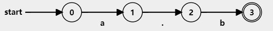	

 

If the character is a '|':
* OR
* Pop two fragments of the stack. (frag1 and frag2)
* Creates a new start and accept state - the new start state is connected to both frag1 and frag2's start state
* Point frag1's and frag2's old accept states at the new accept state

**a|b**

	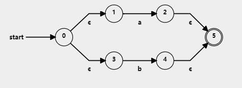	

 

If the character is a '*':
* Zero or More
* Pop a single fragment off the stack. (frag)
* Create a new start and accept states - but point the start state to to the old start state and the new accept state
* The old accept state is then connect to the old start state and the new accept state.

**a***

	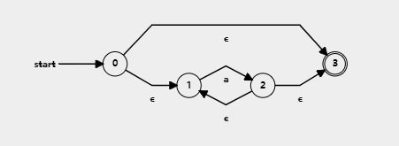	

 

If the character is a '?':
* Zero or one
* Pop a single fragment off the stack. (frag)
* Create a new start and accept state - but point the new start state to to the old start state and the new accept state
* The old accept state is then connect to the new accept state (only) - It doen't connect to the new start state at all.

**a?**

	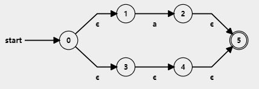	

 

If the character is a '+':
* One or many
* Pop a single fragment off the stack. (frag)
* Creates a new start and accept state - the start state is connented to the old frag's start state
* The old accept state is then connect to the old start state and the new accept state.

**a+**

	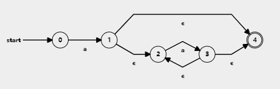	

 

* The else statement is for all characters that are not special. A new accept and start state is created and nothing is popped off the stack.
* The label is set to the character that is been read and the edges is connected to the new accept state.
* A new instance of Frag is created to represent the new NFA and joins two NFA's into one NFA. It then returns exactly one NFA

 

**Followes Function**

It's a recursive function that adds a state to a set, and follows all of the e(psilon) arrows but only if we haven't already seen the state.

 

**Match Function**

* The compile function is called and it compiles the regular expression into an NFA.
* The followes function is then called and adds the first state and follows all e(psilon) arrows.
* The for loop, loops through the string (s). If the label is equal to the character, then add the state arrow to the current set of states.
* This function will return TRUE if the regular expression regex matches the string s, otherwise it returns FALSE.

 

**VIM**
* Vim is a highly configurable text editor for efficiently creating and changing any kind of text. It is included as "vi" with most UNIX systems and with Apple OS X.
* Vim is rock stable and is continuously being developed to become even better. Among its features are:
	* persistent, multi-level undo tree
	* extensive plugin system
	* support for hundreds of programming languages and file formats
	* powerful search and replace
	* integrates with many tools

Insert, quiting, saving and copying (with some research) are easy enough but sometimes I struggled with vim. I was creating files that I didn't want to create and I don't know how I was creating them. After some research I found out that I was creating swap files. I just deleted them everytime I made one by accident until I found out that they can actually be useful. They store changes you've made to the buffer. If Vim or your computer crashes, they allow you to recover those changes. They also provide a way to avoid multiple instances of Vim from editing the same file. This can be useful on multi-user systems or just to know if you have another Vim already editing a file. Now, after using vim for this project I find that I am capable of using vim without any problems and it's good to have in the locker. 

***

## **Research**

I have alot of research. Maybe too much but I just wanted to list everything that I found useful when trying to complete this project.

 

<b>Python:</b>

Learn Python – Full Course for Beginners (Tutorial) It is a 4 hour 30 minutes video that I used to help me learn more on the language.
* [YouTube Python Tutorial](https://www.youtube.com/watch?v=rfscVS0vtbw)

The python documentation is the website I would navigate to if I needed to know anything about the language. Such as, installing pip and the Glossary page. Which has everything regarding python.
* [Documentation](https://docs.python.org/3.8/index.html)

 

<b>Thompson's construction:</b>

Wikipedia page. I wanted to try and understand Thompsons’s Construction a bit better
* [Wikipedia](https://en.wikipedia.org/wiki/Thompson's_construction)

I used the following video to help me for the project and to practice for the summer exam.
* [Regular Expression to NFA](https://www.youtube.com/watch?v=RYNN-tb9WxI)

 

<b>Regular Expression:</b>

I used this site to help me make sure that all my images for this document was correct and I was using it to help me prepare for the exams
* [Convert regular expressions to NFA's](https://cyberzhg.github.io/toolbox/regex2nfa?regex=YSti)

I only used part 7.2.1 to help me with the special characters in my project.
* [Regular Expression Syntax](https://docs.python.org/2/library/re.html#regular-expression-syntax)

Used to help me implement the ? and + special characters.
* [Regular Expression Help](https://swtch.com/~rsc/regexp/regexp1.html)

Brilliant site. Type in a regular expression and hit enter to see an NFA of the regular expression. Again, I used this site to help me make sure that all my images for this document was correct and I was using it to help me prepare for the exams
* [Regexper](https://regexper.com/#)

 

<b>Data Structues</b>

We used a Set within the project so I just wanted to get to know a bit more about the data structure. So i used the following two links to help me out.
* [python.org - Sets](https://docs.python.org/3.8/library/stdtypes.html#set-types-set-frozenset)
* [Real Python - Sets](https://realpython.com/python-sets/)

 

<b>Argparse</b>

I used the following YouTube video to help me implement a command-line options.
* [Python3 Advanced Tutorial](https://www.youtube.com/watch?v=q94B9n_2nf0)

Very useful link and this is where I got the idea to implement verbose.
* [Argparse Tutorial](https://docs.python.org/2/howto/argparse.html)

 

<b>File Writing</b>

The following tutorial helped me implement outputting the regular expression, string and result that the user entered, to a txt file called regExpResults.txt
* [Write to a file](https://www.guru99.com/reading-and-writing-files-in-python.html)

Provided me with the answer on how to concatenate a boolean to a string in Python.
* [Concatenate](https://kite.com/python/answers/how-to-concatenate-a-boolean-to-a-string-in-python)

 

<b>PIP</b>

I did not need to install pip as I have the newest version of python. I am providing this link in case the user does not.
* [Installation](https://pip.pypa.io/en/stable/installing/)

 

<b>coverage.py</b>

The link I used to install coverage
* [Installation](https://coverage.readthedocs.io/en/coverage-5.1/)

 

<b>VIM</b>

I knew nothing about Vim, so I went straight to the Wiki page to see what I can learn about it. It was important that I did because I was going to be using Vim for my project from day one.
* [Wikipedia Page](https://en.wikipedia.org/wiki/Vim_(text_editor))

It is a cheat sheet for Vim. I used this a good bit at the start but once I got the hang of it, I didn’t need it as much.
* [Beginner’s Guide to Vim](https://www.linux.com/training-tutorials/vim-101-beginners-guide-vim/)

The first video I watch when I found out that we were going to use Vim. I jumped straight into Vim thinking I would easily know how to use it. I was wrong. I made a lot of mistakes but this video helped me understand it better.
* [Vim Basics – 8 minute Video](https://www.youtube.com/watch?v=ggSyF1SVFr4)

If no one told you how to copy and paste in Vim, you would never be able to do it. Stackoverflow provided me with the answer.
* [Copy & paste](https://stackoverflow.com/questions/13447066/vi-vim-editor-copy-a-block-not-usual-action/32716157#32716157)

I was creating files that I didn't want to create and I don't know how I was creating them. After some research I found out that I was creating swap files. This question on StackExchange helped me understand what they are and what’s there purpose.
* [Swap Files](https://vi.stackexchange.com/questions/177/what-is-the-purpose-of-swap-files)

 

<b>MISC</b>
* __pycache__:
* [The following help me explain what the folder __pycache__ contains.](https://stackoverflow.com/questions/16869024/what-is-pycache)

 

* __init__.py
* [The following help me explain what the folder __init__file is.](https://pythontips.com/2013/07/28/what-is-__init__-py/)

***
